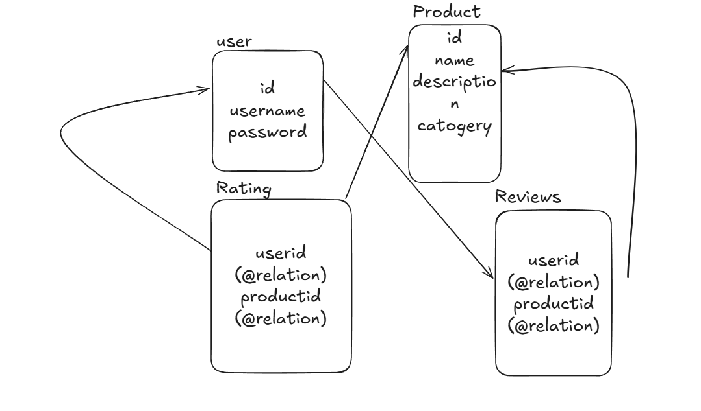

## Database Design (Rough Schema)

The system is designed around core entities such as users, reviews, tasks, and logs. These entities are connected to support high-concurrency task review flows. The image below represents the **rough database schema** used to model the application using Prisma and PostgreSQL:



---

## Project Overview – Task Review Platform (Server)

This is a scalable backend system built to handle real-time task reviews with high concurrency. It uses a robust tech stack optimized for performance, queue-based processing, and modern deployment practices. It supports user authentication, file handling, review workflows, and AI-based enhancements.

### Core Technologies Used

* **Prisma** – Type-safe ORM for PostgreSQL
* **PostgreSQL (Neon)** – Cloud-native relational database
* **Redis + BullMQ** – Queue system for handling concurrent review tasks
* **Cloudinary** – Cloud storage for image and document uploads
* **JWT** – Token-based authentication system
* **Gemini API (Google AI)** – For integrating AI-powered features
* **Bun** – High-performance JavaScript/TypeScript runtime
* **TypeScript** – Strongly typed language for backend logic

---

## Deployment Architecture

* Deployed on **AWS EC2** (Ubuntu)
* Process manager: **PM2**
* Reverse proxy: **Nginx**
* HTTPS: **Certbot (Let's Encrypt)**
* **Live server URL**: `https://api-task.devguy.live`
* **Live frontend URL**: `https://task.devguy.live`

---

## Setup Instructions

### Server Setup

1. Clone the project to your server.
2. Create a `.env` file with the following environment variables:

   * `DATABASE_URL`
   * `JWT_SECRET`
   * `REDIS_HOST`, `REDIS_PORT`, `REDIS_USER`, `REDIS_PASS`
   * `CLOUDINARY_URL`, `CLOUDINARY_CLOUD_NAME`, `CLOUDINARY_API_KEY`, `CLOUDINARY_API_SECRET`
   * `GEMINI_API_KEY`
3. If **Bun** is not installed:

   ```bash
   curl -fsSL https://bun.sh/install | bash
   ```
4. Install dependencies:

   ```bash
   bun install
   ```
5. Run the server locally:

   ```bash
   bun index.ts
   ```

### Production with PM2

```bash
pm2 start index.ts --interpreter bun --name task-api
pm2 save
pm2 startup
```

---

## Nginx + SSL Setup

1. Create a reverse proxy config pointing to your local Bun server.
2. Enable the site and reload Nginx.
3. Issue SSL certificate using Certbot:

   ```bash
   sudo certbot --nginx -d api-task.devguy.live
   ```

---

## Frontend Setup

1. Navigate to the `client` directory.
2. Install dependencies:

   ```bash
   npm install
   ```
3. Start development server:

   ```bash
   npm run dev
   ```


